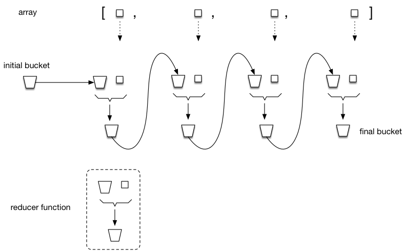

# The arr.reduce() function

The official syntax description for this function is as follows:

```
arr.reduce(callback, [initialValue])
```

I prefer to think of `reduce` as having the following syntax:

```
arr.reduce(reducer, bucket)
```

where:

| param | description |
| ----- | ----------- |
| `reducer` | is a function taking up to four arguments, of which I tend to use the first two only, viz. `bucket` and `elem`,  and which should return (either the same or a new) `bucket`. (Elsewhere you will often see the word `accumulator` being used instead of `bucket`.) |
| `bucket` | is an initial value for the `bucket` argument of `reducer`, i.e. for the first iteration of `arr.reducer()` |

The `reducer` callback function looks like this:

```
(bucket, elem) => {
    // do something with bucket and elem
    return bucket
}
```

The `arr.reduce()` function iterates over the array `arr` from start to finish and for each iteration calls `reducer`, passing the current iteration element from the array and the `bucket` value of the previous iteration _or_ the initial value of `bucket` passed as the second argument to `arr.reduce()` in case of the first iteration.

The value eventually returned by `arr.reduce` is the `bucket` returned from the last iteration. (_Do not forget to ultimately return the bucket from the reducer function!_)

The whole process is visualised in Figure 1 below.


<br>Figure 1. Passing the bucket like in a conveyor belt

## Example 1: using reduce to filter

Although there is a separate `array.filter()` function, let's try and use `arr.reduce` for this:


```
const arr = [6, 3 , 10, 1]
let evenNumbers = arr.reduce((bucket, elem) => {
    if (elem % 2 === 0) {
        bucket.push(elem)
    }
    return bucket
}, [])
console.log(evenNumbers)
```

In this example our bucket is an (initially empty) array. We put elements (in this case integer numbers) in the bucket only when they are divisible by 2.

## Example 2: use reduce to transform elements (i.e. map)

Again, there is already a separate `array.map()` function that accomplishes this, but for our purposes it is illustrative to implement it using `array.reduce()`. In this example an array of integer numbers is mapped to an array of their squares.

```
const arr = [6, 3 , 10, 1]
let squares = arr.reduce((bucket, elem) => {
    bucket.push(elem * elem)
    return bucket
}, [])
console.log(squares)
```

## Example 3: use reduce to group an array by a common property

In this example our bucket is not an array, but an (initially empty) object. It groups the array element by gender.

```
const arr = [
  { gender: 'F', name: 'Joyce'},
  { gender: 'M', name: 'Jim' },
  { gender: 'F', name: 'Lucy' },
  { gender: 'M', name: 'Ferdinand' }
]
let groupedNames = arr.reduce((bucket, elem) => {
  if (bucket[elem.gender]) {
    bucket[elem.gender].push(elem)
    } else {
      bucket[elem.gender] = [elem]
    }
  return bucket
}, {})
console.log(groupedNames)
```

Result:

```
{
  F: [
    { gender: 'F', name: 'Joyce' },
    { gender: 'F', name: 'Lucy' }
  ],
  M: [
    { gender: 'M', name: 'Jim' },
    { gender: 'M', name: 'Ferdinand' }
  ]
}
```

The `arr.reduce()` function might look complex at first but once you get the hang of it can be quite useful and **reduce** :smile: the need for `for` loops in your code.